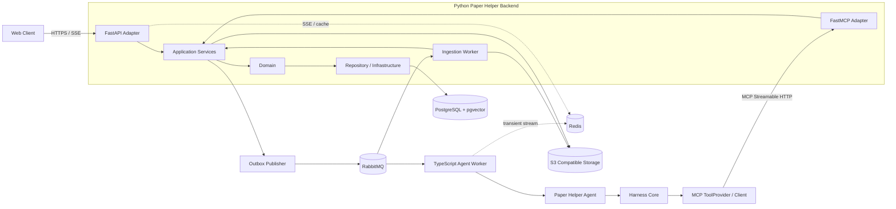

# Paper Helper 技术架构与开发设计

支持首版仓库建设与核心链路开发

| **文档属性** | **内容**                                   |
|--------------|--------------------------------------------|
| 版本         | v0.3                                       |
| 状态         | 开发基线                                   |
| 适用阶段     | MVP 到可演进模块化单体                     |
| 最后更新     | 2026-09-15                                 |
| 主要读者     | 产品负责人、后端开发、Agent 开发、前端开发 |

# 文档结论

Paper Helper 第一阶段不拆分业务微服务，采用“TypeScript Agent 系统 + Python 模块化单体 Backend”的双运行时结构。Python Backend 拥有 Workspace、Source、Research State、Artifact、Conversation、Agent Run 等权威业务状态；FastAPI 与 FastMCP 是同一 Backend 的并列 Gateway Adapter，二者都只能进入 Application Service，不相互调用，也不直接访问 Repository。TypeScript Agent Worker 运行 Paper Helper Agent 与领域无关的 Harness Core，通过 MCP Client 调用 FastMCP 暴露的受控领域工具。Ingestion Worker 继续使用 Python。PostgreSQL 保存权威状态，RabbitMQ 承担跨进程 Command/Event，Redis 承担缓存、限流与短期实时流，S3 兼容对象存储保存原始文件和渲染文件。逻辑边界从代码阶段强制，部署边界按负载和故障隔离逐步演进。

这份文档把架构选择进一步落实为可执行约束，包括目录、模块所有权、核心表、应用接口、MCP 工具、状态机、事务与 Outbox、任务执行、权限、可观测性、测试策略、首期迭代顺序和验收条件。未被本文定义的细节，应优先服从数据所有权和依赖方向，而不是临时跨层调用。

# 目录

| **章节** | **内容**            |
|----------|---------------------|
| 1        | 范围与约束          |
| 2        | 总体架构            |
| 3        | 项目与依赖边界      |
| 4        | 业务模块设计        |
| 5        | 核心数据模型        |
| 6        | 应用接口与 MCP 契约 |
| 7        | 关键运行流程        |
| 8        | Agent 与检索设计    |
| 9        | 一致性与异步任务    |
| 10       | 安全与可观测性      |
| 11       | 开发与部署          |
| 12       | 测试与验收          |
| 13       | 开发计划            |
| 14       | 架构决策记录        |
| 15       | 待定问题            |

# 1 范围与约束

## 1.1 产品问题

Paper Helper 的核心不是一次性总结论文，而是让一个 Workspace 持续积累可追溯、可修订、可回滚的研究认识。聊天是操作界面和工作过程，Source、Evidence、Research State 与 Artifact 才是长期资产。任何重要判断都必须能够回到原始材料位置，任何 Agent 修改都不能无痕覆盖用户确认过的状态。

## 1.2 MVP 成功条件

| **能力** | **MVP 可验证结果**                                               | **不通过条件**                 |
|----------|------------------------------------------------------------------|--------------------------------|
| 材料进入 | 上传 PDF 后形成 Source、Document、Chunk，并保留页码和段落定位    | 只有文件或纯文本，无法定位引用 |
| 研究状态 | Agent 可提出带 Evidence 的新增或修订建议，用户可接受、拒绝和回滚 | Agent 直接覆盖当前状态         |
| 连续工作 | 新增论文后能识别对既有判断的补充、冲突和新问题                   | 每次对话都从零总结             |
| 产物生成 | 综述先保存结构化内容与版本，再渲染为文件                         | 只保存最终 DOCX 或 PDF         |
| 可运维性 | Run 可观察、取消、重试；失败不破坏核心数据                       | 长任务绑定单次 HTTP 请求       |

## 1.3 首版明确不做

首版不引入 Neo4j、不实现自治 Multi Agent、不自建全球论文搜索引擎、不采用复杂通用 Planner、不做跨服务分布式事务，也不以 Temporal 作为前置依赖。只有当跨小时任务的恢复、补偿和人工介入成为稳定需求时，才评估 durable workflow。

## 1.4 质量属性

| **属性** | **目标**                          | **设计响应**                                         |
|----------|-----------------------------------|------------------------------------------------------|
| 正确性   | 业务状态只能由拥有者修改          | Application Service 校验、版本化状态、外键与唯一约束 |
| 可追溯性 | 判断可定位到原文                  | Evidence 引用 Document 位置并保存抽取快照            |
| 可替换性 | 替换模型或 Harness 不迁移业务数据 | 领域后端不依赖 Agent 框架                            |
| 可恢复性 | 任务失败可重试且不重复产生结果    | 幂等键、Outbox、步骤检查点                           |
| 演进性   | 未来可独立扩容 Agent 与 Ingestion | 逻辑模块与部署单元分离                               |

# 2 总体架构

## 2.1 架构分层



图 1 系统逻辑边界与当前运行单元。对应的可编辑源文件为 `Paper_Helper_总体技术架构_v0.3.excalidraw.md`。

用户界面通过 FastAPI Adapter 读取和修改业务状态，并通过 SSE 获取运行事件。Paper Helper Agent 与 Harness Core 使用 TypeScript，Agent 通过 MCP Client 调用 Python FastMCP Adapter。FastMCP 与 FastAPI 都属于 Paper Helper Backend 的 Gateway 层，它们共享同一套 Application Service，但运行进程可以独立；FastMCP 不通过 HTTP 二次调用 Web API。Harness Core 不知道 Workspace、Paper、Research State 等领域类型；FastAPI、FastMCP 和 Worker 都不能绕过 Application Service 直接修改业务状态。

## 2.2 四层职责

| **边界**             | **知道什么**                | **负责什么**                                              | **禁止事项**                                     |
|----------------------|-----------------------------|-----------------------------------------------------------|--------------------------------------------------|
| Harness Core         | 模型、消息、工具、Run、事件 | TypeScript Agent Loop、模型适配、工具运行、流式事件、取消重试、Trace | 出现 Workspace、Paper、Research State 等领域类型 |
| Paper Helper Agent   | 科研任务语义与策略          | TypeScript 任务路由、提示词、研究策略、上下文请求、工具组合          | 直接访问数据库或绕过受控工具/运行接口            |
| FastMCP Adapter      | 领域工具 Schema 与调用身份  | Python MCP 协议、Run Identity 校验、参数转换、调用 Application Service | 承载领域事务、直接访问 Repository、Agent Loop   |
| Paper Helper Backend | 完整业务模型与状态约束      | Python Application/Domain、数据所有权、事务、版本、权限、事件       | 依赖 Harness 或特定模型供应商                    |

## 2.3 当前部署拓扑

开发与早期生产环境建议至少部署四个应用进程：`web_api`、`mcp_server`、`agent_worker`、`ingestion_worker`。`web_api` 与 `mcp_server` 都属于 Python Backend 的 composition root，直接依赖同一组 Application Service，但二者不相互调用。`agent_worker` 使用 TypeScript/Node.js，`ingestion_worker` 使用 Python。PostgreSQL 保存权威业务数据、Run 状态、全文检索字段和向量；RabbitMQ 负责跨进程 Command/Event 与任务调度；Redis 只承担缓存、限流、分布式短期协调和实时流，不作为权威任务队列；S3 兼容对象存储保存原始文件和渲染文件。

> 当前选择不是把模块伪装成微服务，而是先建立可测试的边界。只有数据所有权、调用协议和故障模型稳定后，物理拆库才有意义。

# 3 项目与依赖边界

## 3.1 推荐仓库结构

**建议目录**

```text
paper-helper/
├── agent/
│   ├── apps/
│   │   └── agent-worker/          # RabbitMQ consumer / Agent 运行入口
│   ├── packages/
│   │   ├── paper-helper-agent/    # 科研策略、任务路由、Context Request
│   │   ├── harness-core/          # 领域无关 Agent runtime
│   │   └── harness-mcp/           # MCP ToolProvider / Client Adapter
│   ├── package.json
│   ├── pnpm-workspace.yaml
│   └── tsconfig.json
├── backend/
│   ├── apps/
│   │   ├── web_api/               # FastAPI composition root
│   │   ├── mcp_server/            # FastMCP composition root
│   │   └── ingestion_worker/      # Python RabbitMQ consumer
│   ├── packages/
│   │   ├── workspace/
│   │   ├── sources/
│   │   ├── research/
│   │   ├── artifacts/
│   │   ├── conversations/
│   │   └── agent_runs/
│   ├── migrations/
│   ├── tests/
│   └── pyproject.toml
├── contracts/                     # 语言中立 OpenAPI / JSON Schema / Event Envelope
├── deploy/
├── docker-compose.yml
└── README.md
```

## 3.2 每个业务包内部结构

**模块模板**

```text
backend/packages/research/
├── domain/          # Entity、Value Object、规则、领域事件、Repository Protocol
├── application/     # Command、Query、DTO、Application Service、事务用例
├── infrastructure/  # ORM、Repository 实现、Mapper、外部 Adapter
└── gateway/
    ├── http/         # 可选的 FastAPI Router Adapter
    └── mcp/          # 可选的 FastMCP Tool Adapter；不得放业务规则
```

Application Service 负责一个业务用例的事务边界与编排。Domain 负责不依赖 IO 的状态规则。Repository 只表达持久化意图，不向上泄漏 SQLAlchemy ORM。文件解析、Embedding、模型调用等外部能力以 Port 定义，在 Infrastructure 中实现。

## 3.3 允许的依赖

| **调用方**         | **允许依赖**                                 | **依赖形式**                   |
|--------------------|----------------------------------------------|--------------------------------|
| web_api            | Python 各业务 application                     | 进程内函数调用；FastAPI 仅为 Adapter             |
| mcp_server         | Python application、FastMCP SDK；composition root 可装配 infrastructure | Tool 进程内调用 Application Service；不得通过 web_api 二次转发 |
| paper_helper_agent | harness-core、harness-mcp、TS contracts       | TypeScript workspace package                    |
| harness-core       | TypeScript 标准能力和通用 Port                | 不得依赖任何 Paper Helper 领域包                 |
| agent_worker       | paper-helper-agent、RabbitMQ/Redis adapters    | TypeScript composition root                      |
| ingestion_worker   | sources application、解析 adapters、RabbitMQ  | Python composition root                          |
| 业务模块 A         | 业务模块 B 的 application facade 或稳定 Port  | 禁止访问对方 repository 和 ORM                   |

## 3.4 自动化边界检查

CI 应同时检查 TypeScript 与 Python 边界：`harness-core` 禁止依赖任何 Paper Helper 领域包；FastAPI Router 与 FastMCP Tool 实现只能调用 application facade，禁止直接导入 repository、ORM 或跨模块 infrastructure；`web_api`/`mcp_server` composition root 可以为了依赖注入装配 infrastructure，但不得在 wiring 代码中承载业务规则；domain 禁止导入 FastAPI、FastMCP、SQLAlchemy、RabbitMQ/Redis Client 和模型 SDK；跨业务模块禁止导入对方 infrastructure。跨语言契约只能通过根目录 `contracts/`、MCP Tool Schema、OpenAPI 或版本化 Event Envelope 传播，禁止复制后各自手工演化。

# 4 业务模块设计

| **模块**      | **数据所有权**                           | **核心能力**                         | **主要输出**         |
|---------------|------------------------------------------|--------------------------------------|----------------------|
| Workspace     | workspace、membership、focus             | 项目生命周期、成员权限、当前研究焦点 | WorkspaceSnapshot    |
| Sources       | source、document、chunk、ingestion       | 上传、获取、解析、标准化、索引与定位 | DocumentReady        |
| Research      | state_item、revision、evidence、proposal | 认识版本、证据绑定、提议审查、回滚   | ResearchStateChanged |
| Artifacts     | artifact、revision、render               | 结构化产物、版本、导出任务           | ArtifactRendered     |
| Conversations | conversation、message                    | 对话持久化、消息分页、短期上下文     | MessageCreated       |
| Agent Runs    | run、step、trace_ref                     | Run 生命周期、任务进度、取消、重试   | RunEvent             |
| Search        | 无独立权威数据                           | 元数据过滤、全文、向量检索与融合排序 | RetrievalResult      |

## 4.1 Workspace

Workspace 是用户研究项目的权限边界和生命周期边界。它拥有 title、description、active_focus_id、owner_id 与状态，不拥有论文解析内容。Source 与 Workspace 是多对多关系，使用 WorkspaceSource 保存加入时间、来源角色、可见性和显示顺序。删除 Workspace 默认软删除并异步清理引用，不能立即删除仍被 Artifact Revision 或 Evidence 引用的数据。

## 4.2 Sources

Source 表示一项外部来源的业务身份，Document 表示一次标准化后的可检索内容。相同 DOI 或内容哈希可以复用 Source 与 Document，但 WorkspaceSource 仍然独立。解析结果必须保留 parser_version 和 content_hash；解析器升级时创建新的 Document version，不覆盖旧版本，以保证历史引用仍可解释。

## 4.3 Research

ResearchStateItem 表达一条稳定身份，例如 Claim、Hypothesis、Open Question、Method Note 或 Decision。ResearchStateRevision 保存其每次内容变化。Agent 生成的内容首先进入 Proposal；只有显式策略允许的低风险操作才可自动激活，默认由用户接受后更新 active_revision_id。旧 Revision 永久保留，回滚本质上是把历史 Revision 重新设为当前激活版本并记录新的审计事件。

## 4.4 Artifacts

Artifact 表示综述、提纲、研究报告或演示文稿等产物的稳定身份，ArtifactRevision 保存结构化内容、生成输入快照和引用。DOCX、PDF、PPTX 是 RenderResult，不是权威内容。局部改写从当前 Revision 派生新 Revision，因此后续可比较、回滚并重新渲染多种格式。

## 4.5 Conversations 与 Agent Runs

Conversation 保存交互顺序，不能替代 Research State。Message 可以关联 Run，Run 记录一次任务执行及其输入快照、策略版本和最终结果。PostgreSQL 保存关键 Run 状态、检查点和可恢复 RunEvent；Redis Stream 只保存实时分发视图与高频临时输出。前端断线重连时通过 `last_event_id` 先从 PostgreSQL 补发关键事件，再接续 Redis 实时流。RabbitMQ 负责 Run 调度和关键跨进程事件，不承担面向浏览器的实时流。

# 5 核心数据模型

## 5.1 聚合与关系

第一阶段不追求把所有对象建成一个超大聚合。Workspace、Source、ResearchStateItem、Artifact、Conversation 和 AgentRun 分别拥有自己的不变量与事务边界。跨聚合引用使用 UUID，跨模块更新通过 Application Service 和领域事件完成。Evidence 是 Research Revision 与 Document 位置之间的可审计连接。

| **对象**              | **关键字段**                                                    | **关键约束**                               |
|-----------------------|-----------------------------------------------------------------|--------------------------------------------|
| Workspace             | id, owner_id, title, active_focus_id, status, version           | owner 可访问；version 用于乐观锁           |
| Source                | id, canonical_type, doi, url, file_hash, status                 | DOI 规范化后可唯一；file_hash 用于内容去重 |
| Document              | id, source_id, version, parser_version, content_hash            | source_id 与 version 唯一；版本不可变      |
| DocumentChunk         | id, document_id, ordinal, section, page_start, page_end, text   | document_id 与 ordinal 唯一；保留定位信息  |
| ResearchStateItem     | id, workspace_id, kind, active_revision_id, status              | 稳定身份不保存可变正文                     |
| ResearchStateRevision | id, item_id, revision_no, content, rationale, actor             | item_id 与 revision_no 唯一；不可变        |
| Evidence              | id, revision_id, document_id, locator, quote_snapshot, role     | 引用的 Document version 固定               |
| ResearchProposal      | id, workspace_id, target_item_id, operation, payload, status    | PENDING 只能决议一次；保存预期版本         |
| ArtifactRevision      | id, artifact_id, revision_no, structured_content, provenance    | 不可变；保存生成输入摘要                   |
| AgentRun              | id, workspace_id, type, status, idempotency_key, policy_version | 同作用域 idempotency_key 唯一              |

## 5.2 Research State 类型

| **类型**      | **语义**                     | **典型验证规则**                          |
|---------------|------------------------------|-------------------------------------------|
| CLAIM         | 当前被证据支持的研究判断     | 至少一个 Evidence；标记证据强度和适用范围 |
| HYPOTHESIS    | 尚待验证的因果或关联假设     | 不得写成确定事实；允许无直接 Evidence     |
| OPEN_QUESTION | 需要继续检索或分析的问题     | 具有关闭原因；关闭时关联解决它的 Revision |
| METHOD_NOTE   | 指标、样本、方法或定义的整理 | 优先定位到 Methods 或 Supplement          |
| DECISION      | 用户确认的研究范围或工作决策 | Agent 默认只能提议，不能自动改写          |

## 5.3 Evidence Locator

Locator 采用结构化 JSON，而不是一个不受约束的字符串。最低字段包括 document_id、document_version、page_start、page_end、section_path、char_start、char_end。表格证据可增加 table_id、row_label 和 column_label；无法稳定获得坐标时允许为空，但必须保留 quote_snapshot 和 chunk_id。quote_snapshot 用于审计，展示时仍应从固定 Document version 读取原文。

**Evidence Locator 示例**

```json
{
"document_id": "uuid",
"document_version": 2,
"chunk_id": "uuid",
"page_start": 4,
"page_end": 4,
"section_path": ["Results", "Primary outcome"],
"char_start": 128,
"char_end": 286,
"table_id": null
}
```

## 5.4 建议数据库约束

所有可变聚合包含 version 整数并以乐观锁更新。Revision 表只允许 INSERT，不提供普通 UPDATE。ResearchStateItem.active_revision_id 必须指向同一 item 的 Revision；该跨行约束由事务内服务校验，并通过测试和数据库触发器二选一强化。Proposal 决议使用 compare and set：只有 status=PENDING 且 target_version 等于当前版本时才能成功，否则返回冲突并要求重新评估。

# 6 应用接口与 MCP 契约

## 6.1 Application Service 契约原则

命令接口表达业务意图，不暴露表结构。每个命令包含 actor、workspace_id、request_id 和 expected_version。查询接口返回稳定 DTO，不返回 ORM。FastAPI、FastMCP 和 Python 后台 Worker 都是入口 Adapter，直接调用相同的 Application Service，因此获得一致的权限、事务和业务校验。这里的 Application Service 是进程内业务接口，不等同于 HTTP API；MCP Server 不通过 Web API 二次转发。TypeScript Agent Runtime 的跨进程运行控制使用版本化 HTTP/消息契约，领域能力则通过 MCP Tool 调用。

| **模块**     | **命令或查询**                                                       | **主要结果**                      |
|--------------|----------------------------------------------------------------------|-----------------------------------|
| Workspace    | create_workspace, change_focus, get_workspace_snapshot               | WorkspaceDTO                      |
| Sources      | attach_source, start_ingestion, get_document, search_chunks          | SourceDTO, RetrievalResult        |
| Research     | propose_change, decide_proposal, rollback_item, get_research_context | ProposalDTO, ResearchContextDTO   |
| Artifacts    | create_artifact, revise_artifact, request_render                     | ArtifactRevisionDTO, RenderJobDTO |
| Conversation | append_message, list_messages                                        | MessageDTO                        |
| Agent Runs   | create_run, cancel_run, retry_run, list_run_events                   | RunDTO, RunEventDTO               |

## 6.2 MVP MCP 工具

| **工具**                      | **用途**                             | **副作用与权限**                          |
|-------------------------------|--------------------------------------|-------------------------------------------|
| get_workspace_context         | 获取焦点、当前研究状态和可用来源摘要 | 只读；要求 workspace read                 |
| search_workspace_sources      | 在指定 Workspace 内执行混合检索      | 只读；结果必须带 locator                  |
| get_source_passages           | 按 Source 或 Document 获取原文片段   | 只读；固定 document version               |
| search_papers                 | 调用外部 Scholar Search Port         | 只读外部检索；记录 provider 与 query      |
| add_source_to_workspace       | 创建或复用 Source 并触发 ingestion   | 写入；幂等；要求 workspace write          |
| propose_research_state_change | 提交新增、修订、关闭或合并建议       | 只创建 Proposal，不直接改 active revision |
| create_artifact_revision      | 从结构化输入创建 Artifact Revision   | 写入；保留 provenance                     |
| get_run_status                | 恢复长任务状态与关键事件             | 只读；要求 run 所属 workspace read        |

## 6.3 工具响应规范

工具响应统一包含 data、error、meta。meta 至少包含 request_id、workspace_id、schema_version 和 side_effect。可重试错误与业务拒绝必须区分：TEMPORARY_UNAVAILABLE、RATE_LIMITED 可按策略重试；PERMISSION_DENIED、VERSION_CONFLICT、VALIDATION_FAILED 不得由 Agent 盲目重试。任何写工具必须返回实际产生的资源 ID、版本和幂等命中标记。

**统一结果模型**

```python
class ToolResult(BaseModel):
    data: dict | None = None
    error: ToolError | None = None
    meta: ToolMeta

class ToolError(BaseModel):
    code: Literal[
        "VALIDATION_FAILED", "PERMISSION_DENIED",
        "NOT_FOUND", "VERSION_CONFLICT",
        "RATE_LIMITED", "TEMPORARY_UNAVAILABLE",
    ]
    message: str
    retryable: bool
```

## 6.4 认证传播

前端用户 Token 在 FastAPI Adapter 校验。Agent Run 创建时生成受限的 Run Identity，包含 user_id、workspace_id、run_id、允许的 scopes 和过期时间。FastMCP Adapter 只接受该身份或内部服务身份，并把 actor 直接传入 Application Service。禁止让模型看到长期凭据，也禁止以共享超级用户身份执行所有工具。

# 7 关键运行流程

## 7.1 上传并解析论文

FastAPI Adapter 调用 Sources Application Service，在一个本地事务内创建或复用 Source、创建 WorkspaceSource，并写入 SourceIngestionRequested Outbox 事件。事务提交后 Ingestion Worker 获取原始资源，执行 Detect、Extract、Normalize、Chunk、Metadata 与 Index。每个阶段保存状态和错误信息。成功后写入不可变 Document version 并发布 DocumentReady；失败则保留 Source 及失败阶段，允许从安全检查点重试。

| **阶段**  | **输入**       | **输出**                 | **幂等依据**                       |
|-----------|----------------|--------------------------|------------------------------------|
| Detect    | 原始对象       | mime、文件类型、解析策略 | object hash                        |
| Extract   | 原始对象与策略 | 带页码的元素             | hash + extractor version           |
| Normalize | 元素           | 统一 Document 结构       | extraction id + normalizer version |
| Chunk     | Document       | Chunk 与 section path    | document id + chunker version      |
| Index     | Chunk          | 全文与向量索引           | chunk id + embedding model version |

## 7.2 Agent 分析材料并提出状态修改

Agent Run 创建后，Context Builder 获取 Workspace Focus、已激活的 Research State、用户指定来源和检索结果。模型必须先输出结构化变更建议，再由 Paper Helper Agent 校验引用完整性，最后调用 propose_research_state_change。Research 模块验证权限、目标版本、Evidence 归属与操作类型，只创建 Proposal。用户接受时，在一个事务内插入新 Revision、绑定 Evidence、切换 active_revision_id、决议 Proposal 并写入 Outbox。

## 7.3 生成综述

生成前先冻结 input snapshot，包括 Research State revision IDs、Document versions、用户要求、检索结果 IDs、Agent policy version 与 model metadata。正文先写入 ArtifactRevision.structured_content，其中段落级引用指向 Evidence 或 Document locator。Renderer 从该 Revision 生成 DOCX 或 PDF，RenderResult 只记录格式、对象地址、校验和、renderer_version 和状态。

## 7.4 实时进度

服务端为每个持久化 RunEvent 分配单调递增 sequence。TypeScript Agent Worker 的阶段变化、工具调用摘要、错误、等待用户与终态作为版本化 `run.event` 消息发布到 RabbitMQ，由 Python Agent Runs 消费者通过 Application Service 持久化到 PostgreSQL；高频 token、思考阶段提示等允许丢失的实时输出直接进入 Redis Stream。Web API 通过 SSE 合并 PostgreSQL 中的历史关键事件与 Redis 中的实时流。浏览器重连时携带 `last_event_id`，先补查 PostgreSQL，再接续实时流。Redis 故障不得破坏 Run 的最终业务状态。

# 8 Agent 与检索设计

## 8.1 Harness Core 接口

**Harness Core 最小端口**

```typescript
export interface ModelProvider {
  complete(request: ModelRequest): Promise<ModelResponse>;
}

export interface ToolProvider {
  listTools(): Promise<ToolDefinition[]>;
  callTool(name: string, args: Record<string, unknown>): Promise<ToolResult>;
}

export interface RunStore {
  load(runId: string): Promise<RunSnapshot>;
  appendEvent(event: RunEvent): Promise<void>;
}

export interface EventSink {
  emit(event: RuntimeEvent): Promise<void>;
}
```

Harness Core 的输入是 AgentDefinition、RunInput 与通用 Provider，输出是 RuntimeEvent 和 RunResult。它不决定何为 Research Proposal，也不负责 Workspace 权限。MCP 通过 TypeScript `MCPToolProvider` 接入；RunStore 可以使用受限的 Backend Runtime API 或消息适配器，但不能直接连接 PostgreSQL。

## 8.2 Paper Helper Agent

Paper Helper Agent 由任务分类器、研究策略、Context Request Builder、工具白名单和输出校验器构成。简单问答可以同步流式运行；系统调研、批量分析和 Artifact 生成创建持久 Run。第一版任务路由采用显式规则加一次结构化模型判断，不使用递归万能 Planner。

## 8.3 Context Builder

Context Builder 不读取整个 Workspace。它根据任务构造 Context Plan，再调用后端查询取得焦点、相关 Research State、指定 Source、检索片段、最近必要消息与权限。每个 Context Item 带来源、版本、token 预算和优先级。压缩只生成本轮视图，不能反向修改长期状态。

| **上下文层** | **内容**                               | **默认优先级** | **超预算处理**         |
|--------------|----------------------------------------|----------------|------------------------|
| 任务约束     | 用户请求、输出格式、权限和安全规则     | 最高           | 不得删除               |
| 研究焦点     | Workspace 当前目标和范围               | 高             | 压缩措辞，不丢边界     |
| 研究状态     | 相关 active revisions 与 evidence 摘要 | 高             | 按相关性筛选           |
| 原始证据     | 指定来源和检索片段                     | 高             | 保留 locator，缩小片段 |
| 对话         | 最近必要消息                           | 中             | 摘要或淘汰             |
| 运行记录     | 本 Run 的工具结果与中间状态            | 动态           | 结构化压缩             |

## 8.4 混合检索

检索层先识别可确定过滤条件，再组合 metadata filter、PostgreSQL 全文检索和 vector retrieval。结果以 Reciprocal Rank Fusion 或经验证的加权融合排序，随后执行 workspace 权限过滤与重复片段合并。返回结果必须包含 score_components、document_version 与 locator，避免把向量分数误当成证据可靠度。

## 8.5 Scholar Search Port

外部论文检索只暴露 search_papers、get_metadata、get_abstract 和 get_fulltext 能力。Provider Adapter 负责速率限制、版权边界、失败转换和字段规范化。外部搜索结果不是 Source；只有用户或 Agent 通过受控命令将其加入 Workspace 后，才创建或关联 Source 并进入 ingestion。

# 9 一致性与异步任务

## 9.1 本地事务

单个 Application Service 方法定义一个数据库事务。Router 与 MCP Tool 不直接 commit；Repository 不自行 commit。需要组合多个领域操作时，由上层用例持有 Unit of Work，各 Repository 共享同一事务。跨进程动作不共享 SQLAlchemy Session，使用 Outbox 和幂等消费者。

## 9.2 Outbox

业务表变化与 `outbox_event` 在同一 PostgreSQL 事务提交。Publisher 使用 `FOR UPDATE SKIP LOCKED` 批量领取未发布事件，发布到 RabbitMQ 后记录 `published_at`。消费者使用 `inbox_event` 或业务唯一键去重。消息至少包含 event_id、message_type、message_kind(command/event)、aggregate_type、aggregate_id、aggregate_version、occurred_at、actor、correlation_id、causation_id、schema_version 和 payload。RabbitMQ 投递成功不等于业务处理成功；消费者只有在本地事务提交后才确认消息。

## 9.3 RabbitMQ 与 Redis 分工

RabbitMQ 是跨进程可靠消息通道，承载需要消费确认、重试、死信和背压的 Command/Event，例如 `agent.run.requested`、`ingestion.requested`、`document.ready`、`run.event`。Command 表达“要求某个消费者执行”，Event 表达“某个业务事实已经发生”，二者必须使用不同 routing key/queue 语义，不以一个通用任务队列混用。Redis 不参与权威业务事件投递，只用于缓存、限流、短期锁/租约、SSE 实时分发和可丢失的 token 流；任何只存在 Redis 中的数据都必须可丢失或可由 PostgreSQL/上游重新构建。

## 9.4 幂等策略

| **场景**       | **幂等键**                                       | **重复请求结果**                        |
|----------------|--------------------------------------------------|-----------------------------------------|
| 添加 Source    | workspace_id + normalized DOI 或 file_hash       | 返回现有 WorkspaceSource                |
| 启动 ingestion | source_id + object_hash + pipeline_version       | 返回现有或当前任务                      |
| 创建 Run       | workspace_id + actor_id + client idempotency_key | 返回原 Run                              |
| 决议 Proposal  | proposal_id + expected status PENDING            | 已决议返回当前结果，不二次生成 Revision |
| 渲染 Artifact  | artifact_revision_id + format + renderer_version | 返回已有 RenderResult                   |

## 9.5 Run 状态机


图 2 Agent Run 主状态

RUNNING 可以进入 WAITING_TOOL、WAITING_USER 或 WAITING_RATE_LIMIT 的细分等待态。恢复时从最后一个已提交 Step 开始，而不是重放所有副作用。取消采用协作式取消：先设置 cancel_requested_at，Worker 在模型调用和工具调用边界检查；无法中止的外部调用完成后不得继续提交新业务副作用。

## 9.6 失败处理

重试策略必须以错误类别为依据。网络超时、429 和临时依赖故障可指数退避；Schema 不合法、权限不足和版本冲突不能自动重复。达到最大重试次数后进入 FAILED，并保存 sanitized_error、失败步骤、是否可人工重试和建议动作。任何异常都不能把未经验证的 Agent 内容设为 active Research State。

# 10 安全与可观测性

## 10.1 权限模型

所有业务查询先验证 Workspace membership。权限至少包含 workspace.read、workspace.write、source.write、research.propose、research.decide、artifact.write 和 run.execute。Agent Run 的 scopes 不得超过发起用户权限。DocumentChunk、Evidence 和 Artifact 下载必须再次验证其所属 Workspace，不以难猜 UUID 作为授权机制。

## 10.2 内容与工具安全

论文内容、网页内容和上传文件都视为不可信数据。解析文本中的指令不能提升为系统指令。工具调用必须由 Tool Schema、白名单、作用域和业务层共同限制。具有外部写入或高成本的工具应设置预算与显式策略；日志不得记录访问 Token、完整论文全文或未脱敏的模型请求。

## 10.3 Trace 与指标

| **类型**  | **最小字段或指标**                                      | **用途**                          |
|-----------|---------------------------------------------------------|-----------------------------------|
| Trace     | trace_id, run_id, step_id, tool_call_id, correlation_id | 串联 HTTP、Worker、MCP 和后端事务 |
| Agent     | 成功率、取消率、平均步骤数、token、模型延迟、工具错误率 | 成本和稳定性                      |
| Ingestion | 各阶段耗时、页数、失败类型、队列等待、重复命中率        | 定位解析瓶颈                      |
| Research  | Proposal 接受率、冲突率、无 Evidence 拒绝率、回滚次数   | 判断 Agent 建议质量               |
| Retrieval | 零结果率、点击或引用率、融合分数组成                    | 评估检索有效性                    |

## 10.4 审计

Research Proposal 决议、Research Revision 激活、Artifact Revision 创建、成员权限变化和数据删除必须写 AuditLog。审计记录保存 actor_type、actor_id、action、resource、before_ref、after_ref、reason、run_id、request_id 与时间。AuditLog 不替代版本表，而是解释谁在何时基于什么动作改变了当前指针。

# 11 开发与部署

## 11.1 推荐技术基线

| **领域** | **首版选择**                                  | **理由与边界**                                                |
|----------|-----------------------------------------------|---------------------------------------------------------------|
| Agent Runtime | TypeScript + Node.js + pnpm              | Agent/Harness 独立于 Python 领域实现；使用 TS MCP Client       |
| Backend API | Python + FastAPI + Pydantic v2             | FastAPI 只做 HTTP Adapter；业务规则进入 Application/Domain     |
| MCP      | Python + FastMCP                              | 与 FastAPI 并列 Gateway Adapter；直接调用 Application Service |
| 数据库   | PostgreSQL 16+ + pgvector                     | 权威状态、事务、JSONB、FTS、向量检索                          |
| ORM      | SQLAlchemy 2 Async + Alembic                  | Repository 隔离 ORM；迁移采用 expand/contract                 |
| 消息     | RabbitMQ                                      | 跨进程 Command/Event、确认、重试、死信、背压                  |
| Redis    | Redis                                         | 缓存、限流、短期协调、Redis Stream 实时输出；不做权威任务队列 |
| 对象存储 | S3 Compatible；本地开发 MinIO                 | 原始文件、网页快照、RenderResult；数据库只保存对象元数据       |
| 检索     | PostgreSQL FTS + pgvector                     | MVP 不引入独立向量数据库                                      |
| 实时     | SSE + Redis Stream                            | 浏览器单向实时推送；关键事件仍持久化 PostgreSQL                |
| 观测     | OpenTelemetry + 结构化日志                    | trace_id、request_id、run_id、event_id 贯穿全链路              |
| 部署     | Docker + Docker Compose                       | 本地与首版部署标准化；暂不引入 Kubernetes                     |

## 11.2 配置

配置按 environment、service 和 provider 分层。Python 使用 Pydantic Settings，TypeScript 使用经过 Schema 校验的环境配置，在进程启动时 fail fast。密钥来自部署平台的 Secret，不进入仓库。模型名、Embedding 模型、parser_version、chunker_version、agent_policy_version 和 schema_version 都作为可观察版本记录，不能只存在环境变量中。

## 11.3 本地开发

**开发启动目标形态**

```bash
# infrastructure
docker compose up -d postgres rabbitmq redis minio

# Python backend
cd backend
uv sync
uv run alembic upgrade head
uv run uvicorn apps.web_api.main:app --reload
uv run python -m apps.mcp_server
uv run python -m apps.ingestion_worker

# TypeScript agent
cd ../agent
pnpm install
pnpm --filter agent-worker dev
```

仓库应提供统一 task runner，将 lint、typecheck、unit、integration、migration-check 和 boundary-check 固化为命令。开发者不应手工维护不同应用之间的启动参数。

## 11.4 生产部署

首版可以在一台服务器或一个容器平台部署 `web_api`、`mcp_server`、`agent_worker`、`ingestion_worker` 四个应用容器，并使用 PostgreSQL、RabbitMQ、Redis 与 S3 兼容对象存储。Agent Worker 按并发 Run 数扩容，Ingestion Worker 按 CPU/内存和队列积压扩容，Web API 按请求量与 SSE 连接数扩容，MCP Server 按 Agent tool call 负载独立限流。FastAPI 与 FastMCP 虽可独立部署，但仍共享 Backend Application/Domain 代码，不因此形成两个业务服务。服务拆库前先观察真实资源曲线和故障传播，不根据目录数量决定微服务数量。

## 11.5 API 版本与兼容

HTTP 使用 /api/v1，MCP Tool Schema 使用独立 schema_version，事件 Envelope 也携带 schema_version。增加可选字段属于向后兼容；删除字段、改变语义或枚举值需要新版本。Worker 部署必须容忍至少一个发布窗口内的旧事件，数据库迁移采用 expand and contract。

# 12 测试与验收

## 12.1 测试分层

| **测试**               | **覆盖内容**                                       | **是否依赖外部服务**   |
|------------------------|----------------------------------------------------|------------------------|
| Domain Unit            | Research Revision、Proposal 决议、权限规则、状态机 | 否                     |
| Application Unit       | 用例编排、事务回滚、Port 调用                      | 使用 Fake Repository   |
| Repository Integration | SQL、约束、并发、迁移                              | 真实 PostgreSQL        |
| Contract               | HTTP DTO、MCP Schema、事件兼容                     | 本地 Provider 或快照   |
| Pipeline Golden        | PDF 元素、页码、表格、chunk 定位                   | 固定测试文档           |
| Agent Evaluation       | 引用正确率、Proposal 合法率、上下文选择            | 固定模型版本或录制响应 |
| End to End             | 上传到状态建议再到 Artifact                        | 完整测试环境           |

## 12.2 必测并发场景

至少验证两个用户同时决议同一 Proposal、同一用户重复提交添加论文、Worker 重复消费 DocumentReady、Run 取消与工具完成并发、Artifact 同一 Revision 重复渲染、ResearchStateItem 以旧 expected_version 更新。每个场景必须证明不会生成重复 Revision、不会丢失 active pointer，也不会把失败任务标成成功。

## 12.3 MVP 验收链路

| **步骤** | **验收动作**                  | **通过标准**                                      |
|----------|-------------------------------|---------------------------------------------------|
| 1        | 建立 Workspace 并上传五篇论文 | 五个 WorkspaceSource 可见；每个 Source 有处理状态 |
| 2        | 等待解析完成并打开任意片段    | 可跳转到正确页码或 section；版本可追溯            |
| 3        | 请求 Agent 总结当前方向       | 产生结构化回答和带 Evidence 的 Proposal           |
| 4        | 接受、拒绝和回滚不同 Proposal | 当前状态正确；历史、actor 与 reason 完整          |
| 5        | 再加入三篇论文并请求差异分析  | 能关联既有 Revision，指出补充、冲突与新问题       |
| 6        | 生成综述并修改第二部分        | 形成新 ArtifactRevision；旧版本不变；引用可定位   |
| 7        | 中断并恢复长任务              | 不重复副作用；进度事件连续；终态准确              |

# 13 开发计划

## 13.1 迭代顺序

| **阶段** | **核心交付**                                       | **完成门槛**                     |
|----------|----------------------------------------------------|----------------------------------|
| 阶段 0   | Monorepo、包边界、配置、迁移、CI、基础认证         | 边界检查和空应用可运行           |
| 阶段 1   | Workspace、Source 上传、对象存储、Ingestion 状态   | PDF 可形成可定位 DocumentChunk   |
| 阶段 2   | Research State、Revision、Evidence、Proposal       | 用户可审查、回滚且并发安全       |
| 阶段 3   | Harness Core、MCP Adapter、Paper Helper Agent、Run | Agent 只能通过工具读取和提议变更 |
| 阶段 4   | 混合检索、Context Builder、SSE                     | 上下文可解释，长任务可恢复进度   |
| 阶段 5   | Artifact Revision 与 DOCX/PDF Renderer             | 局部修改产生新版本并保留引用     |
| 阶段 6   | 评估集、性能、权限审计、部署加固                   | 完整 MVP 验收链路通过            |

## 13.2 第一批开发任务

| **任务**                            | **前置**                      | **产出**                                         |
|-------------------------------------|-------------------------------|--------------------------------------------------|
| 建立语言中立 contracts              | 无                            | OpenAPI、JSON Schema、EventEnvelope、错误码       |
| 建立 Workspace 聚合                 | contracts                     | 迁移、Repository、Application Service、HTTP API  |
| 建立 Source 与 Document 模型        | Workspace                     | 上传、对象 key、pipeline 状态、定位 Schema       |
| 实现 Ingestion 端到端薄切片         | Source                        | 单一 PDF parser 到可检索 chunk                   |
| 建立 Research Revision 与 Proposal  | Document                      | Evidence 校验、接受拒绝回滚                      |
| 定义 TypeScript Harness Protocol     | contracts                     | ModelProvider、ToolProvider、RunStore、EventSink |
| 实现 MCP ToolProvider 与 FastMCP Adapter | Harness Protocol、Application Service | 列工具、调工具、身份传播；不经 Web API 转发     |
| 实现第一个 Agent 用例               | Research、MCP                 | 基于指定论文提出一个带证据的 Claim               |

## 13.3 每个阶段的 Definition of Done

一个阶段只有在迁移可在空库执行、核心规则有单元测试、跨边界契约有测试、日志包含 request_id 与 trace_id、权限验证覆盖读写路径、失败能够形成可诊断状态、README 给出本地运行方式、架构文档同步更新后才算完成。能跑通 Happy Path 但无法解释失败和重复执行，不视为完成。

# 14 架构决策记录

| **编号** | **决策**                                   | **状态** | **关键后果**                            |
|----------|--------------------------------------------|----------|-----------------------------------------|
| ADR 001  | 业务后端首版采用模块化单体                 | Accepted | 保留本地事务，降低分布式复杂度          |
| ADR 002  | Agent 与 Ingestion 使用独立 Worker         | Accepted | 长任务故障和资源隔离                    |
| ADR 003  | Research State 和 Artifact 全部版本化      | Accepted | 支持历史、diff、回滚和审计              |
| ADR 004  | Evidence 从第一版进入核心模型              | Accepted | 所有重要判断可回到固定 Document version |
| ADR 005  | Harness Core 与 Paper Helper 领域解耦      | Accepted | 运行时可复用和替换                      |
| ADR 006  | MCP 通过 ToolProvider Adapter 接入 Harness | Accepted | Harness Core 不依赖 MCP SDK             |
| ADR 007  | FastMCP Adapter 不承载领域逻辑             | Accepted | 工具入口与业务规则一致                  |
| ADR 008  | 跨进程一致性使用 Outbox                    | Accepted | 接受最终一致性并要求幂等消费            |
| ADR 009  | 首版混合检索基于 PostgreSQL FTS + pgvector | Accepted | 降低组件数量，后续用真实数据验证召回质量 |
| ADR 010  | Agent 修改默认先形成 Proposal              | Accepted | 用户保持最终控制                        |
| ADR 011  | Agent/Harness 使用 TypeScript，Backend/MCP 使用 Python | Accepted | 语言边界强化运行时与领域解耦             |
| ADR 012  | FastAPI 与 FastMCP 是 Backend 并列 Gateway Adapter | Accepted | MCP 不通过 Web API 二次转发               |
| ADR 013  | RabbitMQ 承担可靠 Command/Event，Redis 承担临时状态与实时流 | Accepted | 避免两套队列语义重叠                     |
| ADR 014  | 原始文件与渲染文件使用 S3 Compatible Object Storage | Accepted | PostgreSQL 不保存大二进制对象             |

## 14.1 微服务拆分触发条件

只有当某个模块同时具备稳定 API、明确数据所有权、显著不同的扩容或故障模型，并且拆分收益高于跨服务一致性成本时才独立成服务。最可能先拆的是 Ingestion 和 Agent Runtime；Research State 与 Workspace 在出现独立团队、独立扩容或明确事务边界之前继续留在 Research Core。

# 15 待定问题

以下问题不会阻塞阶段 0 和阶段 1，但必须在相关功能开始前形成 ADR。外部 Scholar Provider 的授权与全文获取边界决定 Search Adapter；PDF 表格和公式的定位精度决定 Evidence Locator 扩展；Proposal 的低风险自动接受范围决定用户控制强度；Artifact `structured_content` 的 Schema 决定多格式渲染能力；RabbitMQ 的 exchange/queue/routing key、重试和 DLQ 策略需要在 Worker 薄切片中验证；Redis Stream 的保留长度与断线恢复窗口需要压测确定；pgvector 的索引参数必须根据真实语料规模和召回评估确定。

## 15.1 反向风险检查

该设计最大的风险不是模块拆得不够，而是边界数量超过单人或小团队的维护能力。若开发中大量 DTO 映射和跨模块调用没有带来可测试的不变量，应合并接口而不是维护形式化分层。另一个风险是过早把 Research State Schema 固化为过细枚举，导致真实研究过程无法表达；应以小规模用户材料验证类型和 Proposal 操作。混合检索、自动状态整理和 Evidence 定位都必须通过评估集证明价值，不能以架构完整代替产品有效。

# 附录 A 首版接口约定

**HTTP 路由草案**

```text
POST /api/v1/workspaces
POST /api/v1/workspaces/{workspace_id}/sources
GET /api/v1/workspaces/{workspace_id}/research-context
POST /api/v1/workspaces/{workspace_id}/research-proposals
POST /api/v1/research-proposals/{proposal_id}/decision
POST /api/v1/workspaces/{workspace_id}/runs
GET /api/v1/runs/{run_id}
GET /api/v1/runs/{run_id}/events
POST /api/v1/runs/{run_id}/cancel
POST /api/v1/workspaces/{workspace_id}/artifacts
POST /api/v1/artifacts/{artifact_id}/revisions
POST /api/v1/artifact-revisions/{revision_id}/renders
```

# 附录 B 命名约定

| **对象** | **规则**                                             | **示例**                       |
|----------|------------------------------------------------------|--------------------------------|
| 数据库表 | snake_case 单数或团队统一复数，不混用                | research_state_revision        |
| 事件     | 过去式领域事实                                       | ResearchStateRevisionActivated |
| 命令     | 动词开头表达意图                                     | DecideResearchProposal         |
| 查询     | get 用于唯一对象，list 用于集合，search 用于排序召回 | get_document, search_chunks    |
| MCP 工具 | snake_case，面向 Agent 说明副作用                    | propose_research_state_change  |
| 版本字段 | 稳定对象用 version，Revision 用 revision_no          | expected_version=4             |
